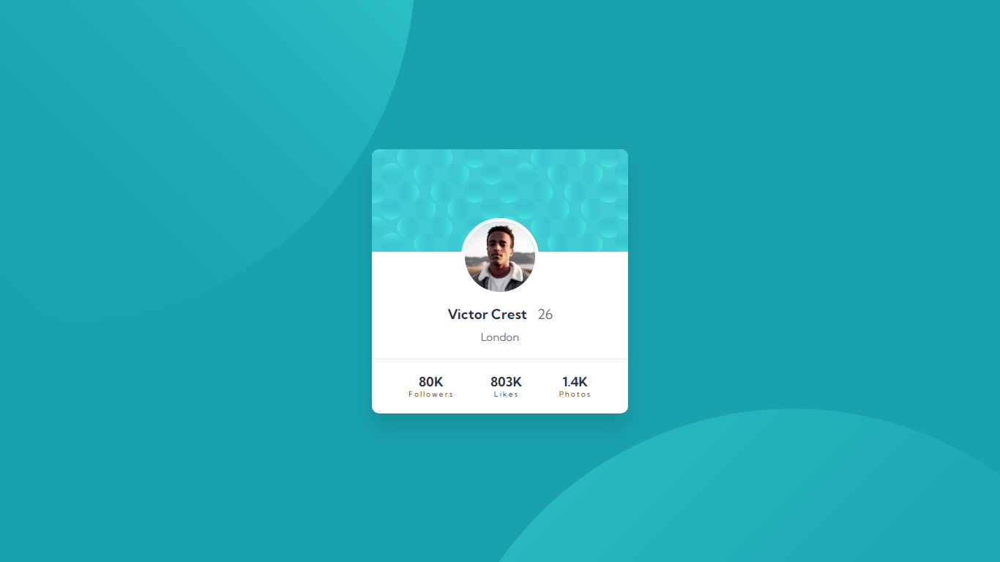

# Profile Card Component Challenge

This repository contains my solution to the "Profile Card Component" challenge from [**Frontend Mentor.**](frontendmentor.io)

## Challenge Description

The "Profile Card Component" challenge is a frontend coding challenge that involves creating a profile card component according to the given design. The challenge focuses on improving HTML and CSS skills and creating a responsive design.

## Challenge Requirements

* Create a profile card component that matches the design provided by Frontend Mentor.
* The design includes a user image, user name, user age, user location, and a number of followers.
* The design should be responsive and optimized for desktop view (mobile view is optional).
* Use HTML and CSS to create the component.
Ensure that the design is pixel-perfect, matching the provided design.

## My Solution

I completed this challenge by creating an HTML file for the structure of the profile card and a CSS file to style the card based on the design requirements. My solution focuses on the desktop version of the profile card.

Here are some key points about my solution:

* The HTML structure is clean and semantic, with appropriate use of HTML5 elements.
* I used CSS to style the profile card, including positioning elements, setting fonts, and adding responsive design features.
* My solution includes a screenshot of the completed profile card for reference.

## Preview

You can view my solution to the "Profile Card Component" challenge by [**clicking here.**](https://profile-card-eta-mocha.vercel.app/)

## Screenshot

## About Frontend Mentor

Frontend Mentor is a platform that provides coding challenges aimed at improving frontend development skills. These challenges include various designs and requirements that help developers practice their HTML, CSS, and JavaScript skills. You can learn more about Frontend Mentor at **https://www.frontendmentor.io.**

Feel free to explore my solution and use it as a reference for your own projects. If you have any questions or feedback, please don't hesitate to reach out. Happy coding! 😊❤️
